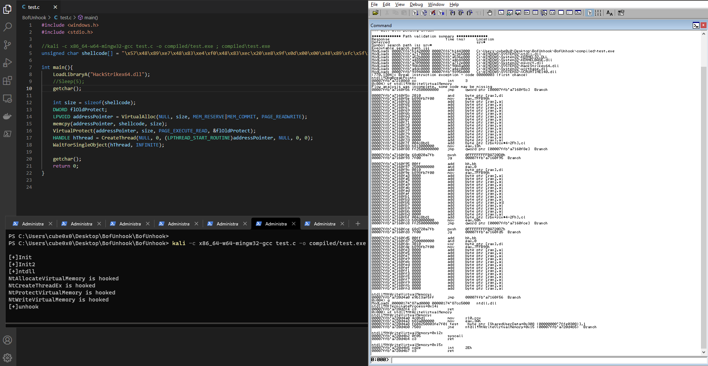
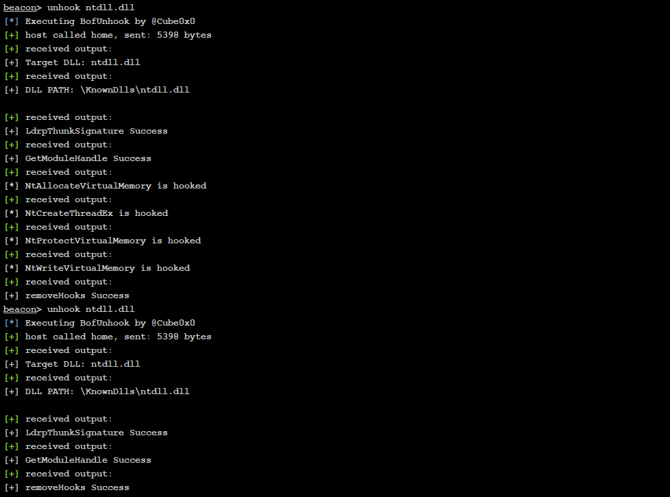

# SyscallPack

Beacon Object File and Shellcode for full DLL unhooking. 

1. Get handle to hooked DLL
2. Get dynamic Syscalls for `NtOpenSection` and `NtMapViewOfSection` 
3. Load unhooked DLL from `/KnownDlls/`
4. Patch hooked functions
4. Unload unhooked DLL

## unhook-PIC

Unhook `ntdll.dll` with shellcode. Only support for x64 atm! 
Convert pic exe to shellcode format with `for i in $(objdump -d compiled/unhook-pic.exe |grep "^ " |cut -f2); do echo -n '\x'$i; done; echo` 

## unhook-BOF

Unhook all hooked functions for a specified DLL

### Acknowledgements

* Heavily inspired by Conti Locker
* `addresshunter.h` from [@ParanoidNinja](https://github.com/paranoidninja/PIC-Get-Privileges)
* [@peterwintrsmith](https://twitter.com/peterwintrsmith) for [Parallelsyscalls](https://www.mdsec.co.uk/2022/01/edr-parallel-asis-through-analysis/)
